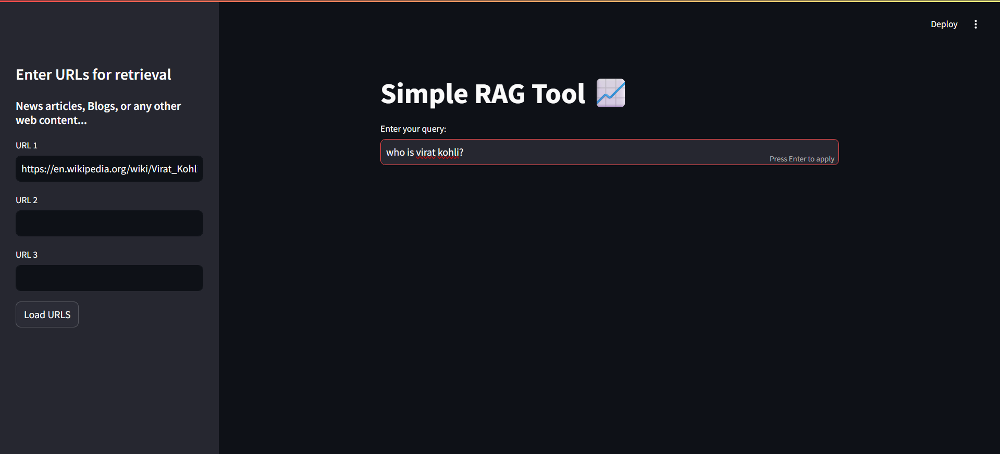

#  Simple RAG tool

I recently started learning more about AI and LLMs and wanted to work on RAG (Retrieval Augmented Generation). This is a simple RAG tool built using Langchain that uses FAISS for vector storing and Google's gemini-2.0-flash model.

It's a simple web application that allows you to perform **question-answering over any webpage content**. It can allow you to enter multiple sources (URLs) for articles, blogs etc. and you can ask questions for information retrieval instead or reading the web-content yourself.

---

##  Features

-  Load up to 3 web URLs (articles, blogs, documents).
-  Automatically chunks and embeds content using Gemini embeddings.
-  Semantic vector search with FAISS.
-  Ask questions about the loaded content in natural language.
-  Displays source references for answers.

---

##  How to Run Locally

### 1. **Clone the repo**

```bash
git clone https://github.com/your-username/simple-rag-tool.git
cd simple-rag-tool
```
### 2. **Install dependencies**

```bash
pip install -r requirements.txt
```
### 3. **Set up your API key**
Create a file named keys.env in the root directory:
```ini
GOOGLE_API_KEY= your_gemini_api_key_here
```
### 5. **Run the app**
```bash
streamlit run main.py
```

---

## Check it out!




---

## Acknowledgements

This tool is my spin on the tool built by codebasics you can follow the video 👉[here](https://www.youtube.com/watch?v=MoqgmWV1fm8&list=PLeo1K3hjS3uu0N_0W6giDXzZIcB07Ng_F&index=7)
It's a pretty sweet tutorial for langchain.
